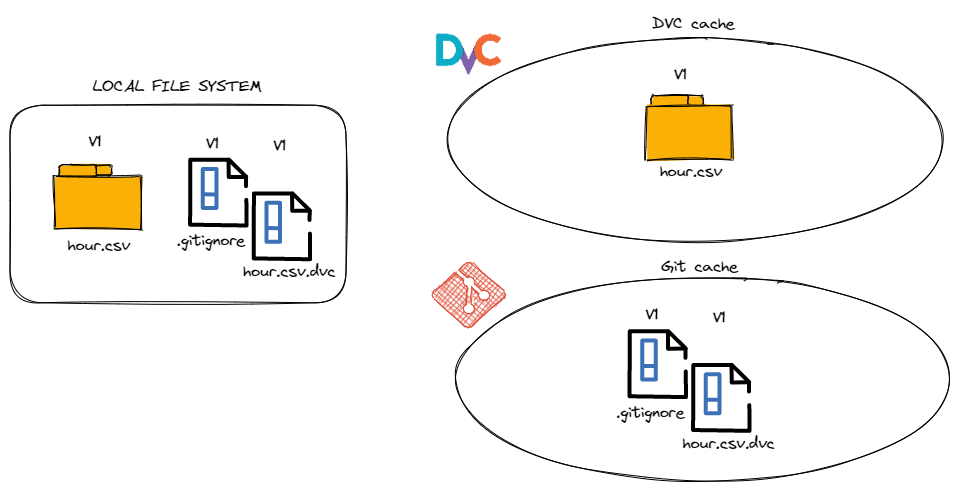

# Data Version Control with DVC

## 1. Introduction to the Practice

This hands-on practice helps you get familiar with **DVC (Data Version Control)**, a powerful tool for managing data versions. Through this exercise, you will explore the following key concepts:

- **Data Versioning**: Learn how to maintain and track different versions of your datasets
- **Retrieve Data on Another Machine**: Understand how to fetch and access versioned data across different systems
- **List/Switch Between Data Versions**: Master switching between different versions of your data efficiently

## 2. About DVC (Data Version Control)

Unlike Git, which is designed for source code version control, **DVC** takes a different approach to data versioning. Rather than storing large data files directly in the repository, DVC operates through a clever mechanism:

- **Metadata Files (.dvc)**: DVC creates lightweight metadata files with the `.dvc` extension that act as **pointers** to your actual data
- **Git Integration**: These `.dvc` files are tracked by Git, enabling version control of your datasets
- **DVC Cache**: Actual large data files are securely stored within the local system's **DVC cache** (a local storage layer)
- **Remote Storage Synchronization**: Your cached data can be synchronized with remote storage repositories, ensuring backup and accessibility across different machines

This design makes DVC particularly efficient for managing large datasets while keeping your Git repository lean and fast.

{width=600px}

*Image source: [Getting Started with DVC - DAGsHub](https://dagshub.com/blog/getting-started-with-dvc/)*

## 3. Project Structure

This repository is organized as follows:

```
sentiment-dvc/
├── data/                          # Data storage directory
│   └── raw/
│       ├── sentiment.csv          # Raw dataset file
│       └── sentiment.csv.dvc      # DVC metadata file (pointer to data version)
│
├── notebook/                      # Jupyter notebooks for demonstrations
│   └── Ex1_DVC_Data_Version_Control.ipynb
│
├── Report.pdf                      # Project documentation
├── README.md                      
└── .dvc/                          # DVC configuration directory
```

---

**Last Updated**: March 28, 2026
